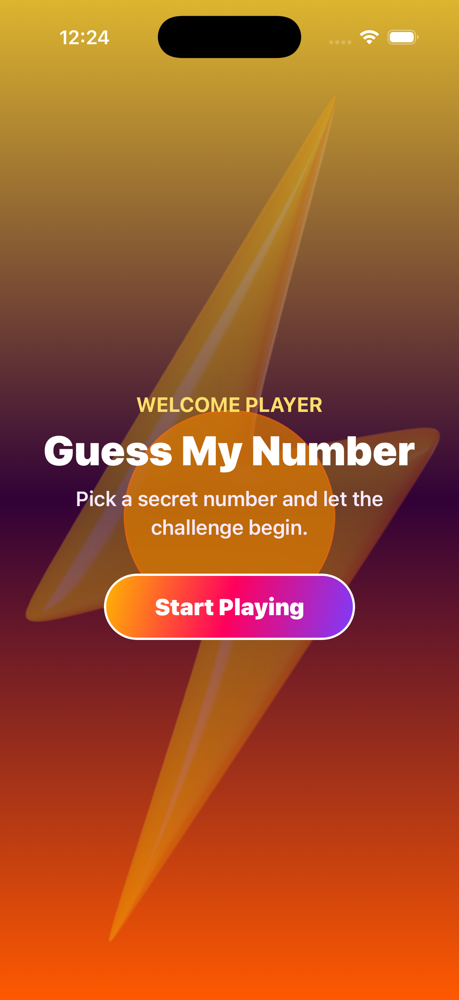
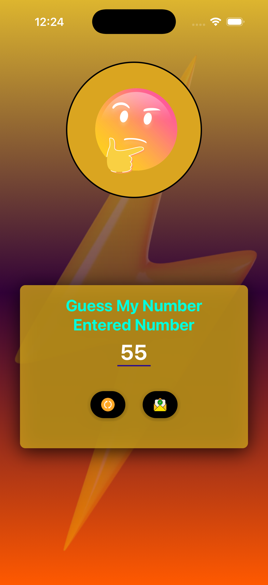
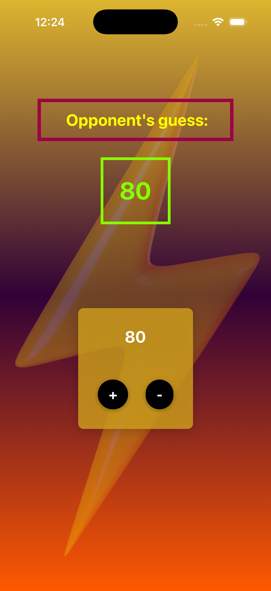
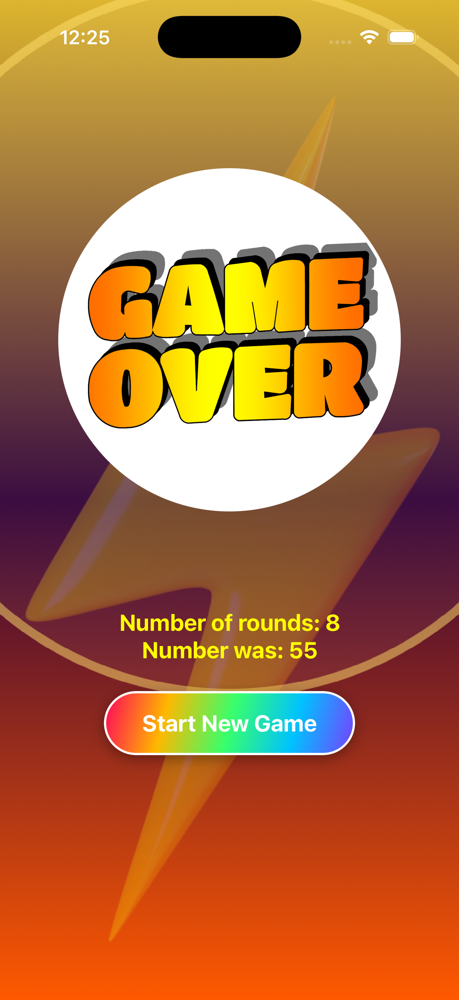

<p align="center">
  
</p>

<p align="center">
  
  
  
  
</p>

<p align="center">
  <b>A colorful mobile number guessing game built with Expo and React Native.</b>
  <br />
  Choose a secret number, guide the opponent with higher/lower hints, and finish with a bright animated game-over screen.
</p>

---

## Preview

<p align="center">
  
  
  
  
</p>

## Highlights

| Feature | Description |
| --- | --- |
| Animated welcome screen | A splash-style intro with bold copy, gradient button, and motion effects. |
| Number picking flow | The player enters a number between 1 and 99 before the guessing round starts. |
| Higher/lower gameplay | The app guesses and the player guides it with simple controls. |
| Game-over summary | Shows the secret number, total rounds, and a restart action. |
| Custom visual style | Uses gradients, image backgrounds, bright colors, and themed artwork. |

## Tech Stack

| Tool | Purpose |
| --- | --- |
| Expo | Development workflow and native app runtime. |
| React Native | Cross-platform mobile UI. |
| Expo Linear Gradient | Colorful gradient backgrounds and buttons. |
| Expo Splash Screen | Native startup splash handling. |
| Expo Font | Custom font loading. |

## Getting Started

Clone the project and install dependencies:

```bash
npm install
```

Start the Expo development server:

```bash
npm start
```

Then open the app with Expo Go, an iOS simulator, an Android emulator, or web:

```bash
npm run ios
npm run android
npm run web
```

## Project Structure

```text
.
├── App.js
├── assets
│   ├── fonts
│   ├── images
│   └── screenshots
├── components
│   ├── game
│   └── ui
├── constants
└── screens
    ├── gameoverscreen.js
    ├── gamescreen.js
    ├── startgamescreen.js
    └── welcomescreen.js
```

## Screens

| Screen | Purpose |
| --- | --- |
| `welcomescreen.js` | First animated welcome experience. |
| `startgamescreen.js` | Number input and validation. |
| `gamescreen.js` | Opponent guess and higher/lower controls. |
| `gameoverscreen.js` | Result summary and restart button. |

## Available Scripts

```bash
npm start
npm run ios
npm run android
npm run web
```

## About

Guess My Number is a small, playful Expo project focused on practicing React Native state, reusable UI components, image assets, gradients, splash behavior, and simple animations.
